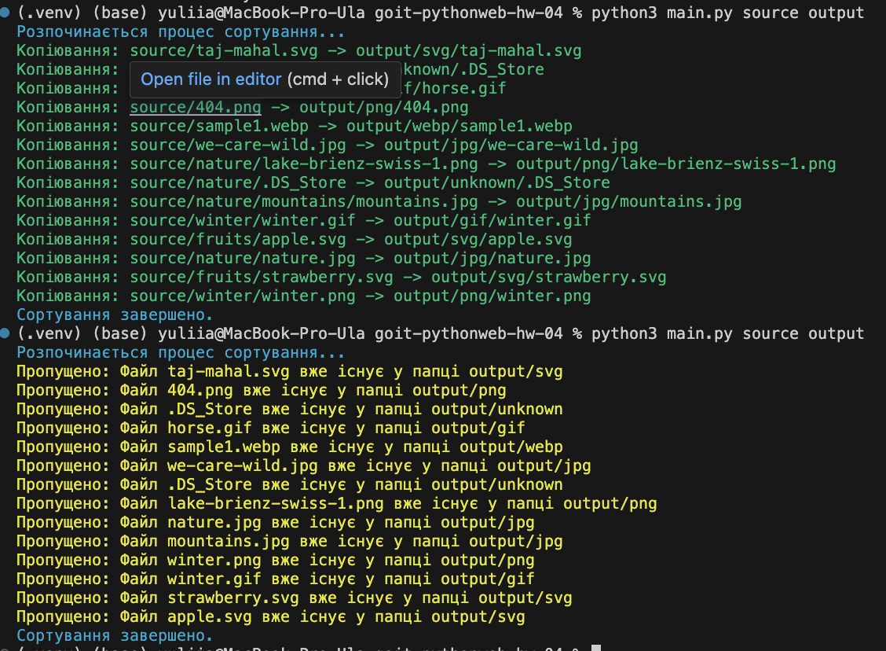

# Тема 4. Домашня робота

Напишіть Python-скрипт, який буде читати всі файли у вказаній користувачем
вихідній папці (source folder) і розподіляти їх по підпапках у директорії
призначення (output folder) на основі розширення файлів. Скрипт повинен
виконувати сортування асинхронно для більш ефективної обробки великої кількості
файлів.

## Технічний опис завдання

1. Імпортуйте необхідні асинхронні бібліотеки.
2. Створіть об'єкт `ArgumentParser` для обробки аргументів командного рядка.
3. Додайте необхідні аргументи для визначення вихідної та цільової папок.
4. Ініціалізуйте асинхронні шляхи для вихідної та цільової папок.
5. Напишіть асинхронну функцію `read_folder`, яка рекурсивно читає всі файли у
   вихідній папці та її підпапках.
6. Напишіть асинхронну функцію `copy_file`, яка копіює кожен файл у відповідну
   підпапку у цільовій папці на основі його розширення. Налаштуйте логування
   помилок.
7. Запустіть асинхронну функцію `read_folder` у головному блоці.

## Критерії прийняття

1. Код успішно виконує асинхронне читання та копіювання файлів.
2. Файли розподілено по підпапках на основі їх розширень.
3. Програма коректно обробляє аргументи командного рядка.
4. Усі помилки логовано.
5. Код читабельний та відповідає стандартам PEP 8.

## Підготовка та завантаження домашнього завдання

1. Створіть публічний репозиторій `goit-pythonweb-hw-04`.
2. Виконайте завдання та відправте його у свій репозиторій.
3. Завантажте робочі файли на свій комп’ютер та прикріпіть їх у LMS у форматі
   `zip`.
4. Назва архіву повинна бути у форматі ДЗ4_ПІБ.
5. Прикріпіть посилання на репозиторій `goit-pythonweb-hw-04` та відправте на
   перевірку.

## Формат оцінювання

- Залік / Незалік

## Формат здачі

- Прикріплені файли репозиторію у форматі `zip` з назвою `ДЗ4_ПІБ`.
- Посилання на репозиторій.

> [!IMPORTANT]
>
> ВАЖЛИВО Перегляньте Інструкцію щодо завантаження робочого файлу з репозиторію
> на Github

### Результат виконаного завдання

